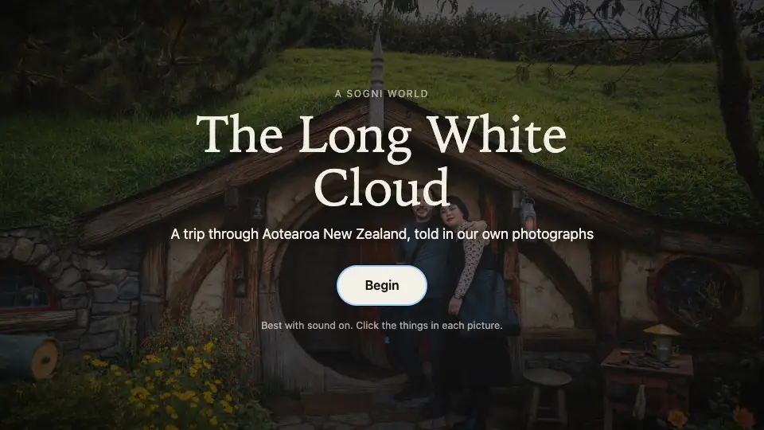
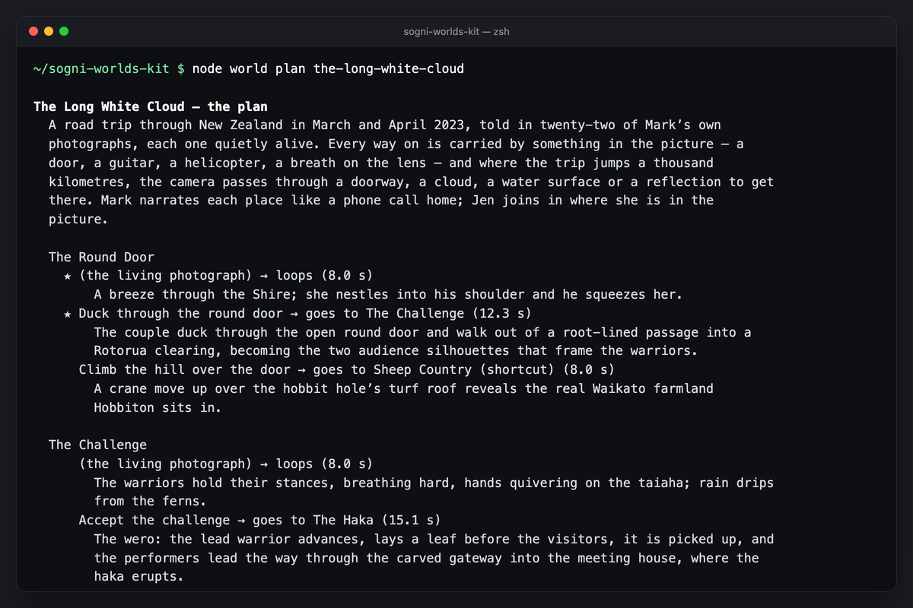
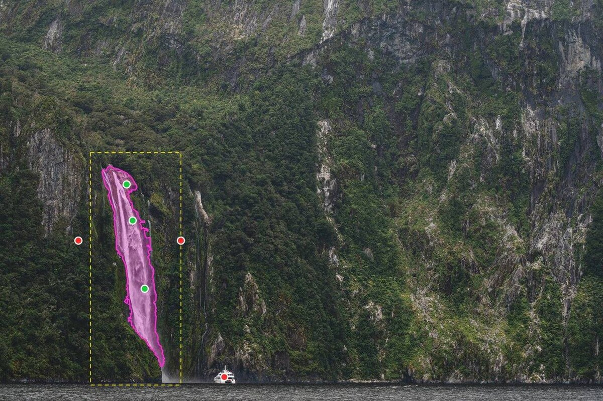
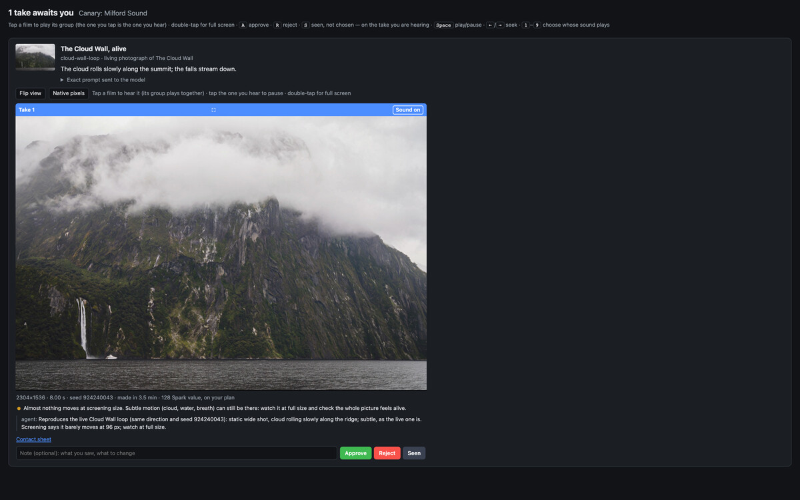
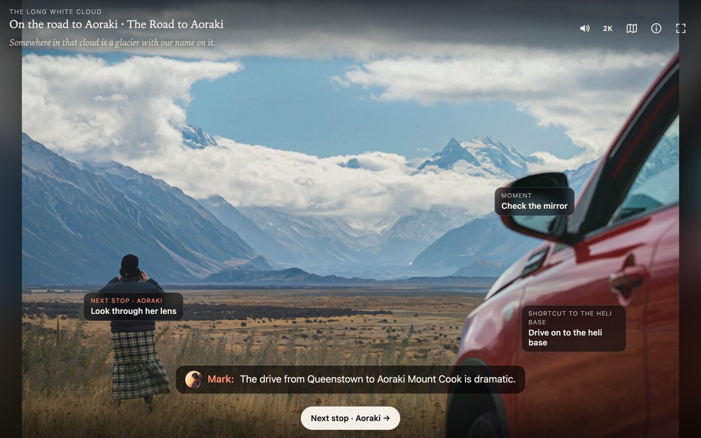

<a href="https://worlds.sogni.ai/demo/the-long-white-cloud"></a>

<sub>A real recording of the player: one click on the round door, one film, the next place. Click it to play the whole world, or [watch it as MP4](docs/media/hero.mp4).</sub>

# Sogni Worlds Kit

**A cinematic, choose-your-own-adventure world you click through, built by your
coding agent from your photos, or from nothing but an idea.**

[▶ Play The Long White Cloud](https://worlds.sogni.ai/demo/the-long-white-cloud) ·
[How this was made](https://worlds.sogni.ai/how-this-was-made) ·
[How agents built Sogni World](https://blog.sogni.ai/blogs/how-agents-built-sogni-world/) ·
[Build with your agent](https://worlds.sogni.ai/build-with-agent)

Each place quietly comes alive. Click something in it (a door, a boat, a guitar)
and a film carries you to the next place, passing through the door, over the
ridge or down through the cloud. A voice tells the story and music sits
underneath. Some choices can be fatal, and the visitor rewinds to choose again;
some things you click are collectibles you pick up and turn over in 3D.

This repo holds everything we used to build *The Long White Cloud*, a trip
through New Zealand in 22 photographs on [worlds.sogni.ai](https://worlds.sogni.ai):

- the pipeline that renders and judges every film
- the rules for directing those films
- the player that shows the finished world
- the instructions your agent follows

You bring the taste, and either your photos or a concept. Your agent (Claude Code,
Codex or Hermes) does the rest with the
[Sogni Creative Agent Skill](https://github.com/Sogni-AI/sogni-creative-agent-skill)
and your Sogni API key: eleven open-source models paint the places, trace what you
click, film every crossing, narrate, score and build the collectibles
([every model](#the-models)). Start in the evening, and a whole world of dozens of
2K films is yours to judge by morning.

## See it in 60 seconds

```bash
git clone https://github.com/Sogni-AI/sogni-worlds-kit
cd sogni-worlds-kit
npm install
npm run dev
```

Open the URL it prints. *The Long White Cloud* plays straight from Sogni's CDN. No
account needed.

## Build your own

You need Node 22.12+, [ffmpeg](https://ffmpeg.org/download.html), a
[Sogni account and API key](https://dashboard.sogni.ai/api-key), and a coding agent.

```bash
node world setup            # saves your API key, checks your plan, installs the Creative Agent Skill
node world new my-trip      # then copy your photos into worlds/my-trip/photos/, or bring an idea instead
```

Open your agent in this folder and say either:

> Build a Sogni World from the photos in worlds/my-trip.

> Build a Sogni World from this concept, with no photos: a lighthouse keeper's last
> night on a rock in the Atlantic, in seven places. Two choices are fatal and every
> place hides a collectible. Paint the places.

Your agent reads [AGENTS.md](AGENTS.md) and then:

1. interviews you: the story, the people and the order of places. For a concept it
   writes a short bible instead (places, characters, look, what leads where) and
   paints the places with Krea 2 for you to approve
2. looks at every still at full size and writes the plan: what to click, where it
   leads (and which choices end the story), and a direction for every film
3. shows you the plan and the cost, then renders a **canary** (one journey and one
   living picture)
4. screens each take for dissolves, morphs and glitches, rejects the broken ones
   and sends you the rest

```bash
node world review           # you approve or reject each film, side by side, with sound
```

On that page you can also pause a take, drag a box and type a note, so your agent
sees exactly where a retake has to change.

Then it renders the rest, retakes what you rejected with a rewritten direction,
adds narration, music and the 3D figures, and builds the world:

```bash
node world play             # play it locally
node world export           # a static folder you can host anywhere
```

Lost at any point? `node world next` prints the one thing to do now.

## Get the Unlimited plan

A world is dozens of native 2K films, and that's where a plan pays off.

| | Pay as you go | [Unlimited](https://docs.sogni.ai/pricing/unlimited-plan-details/) | [Unlimited Pro](https://docs.sogni.ai/pricing/unlimited-plan-details/) |
| --- | --- | --- | --- |
| Price | per render | $20 / month | $50 / month |
| A 2K film (MiniMax H3) | about $0.50–$1.20 each | covered | covered |
| H3 films rendering at once | — | 2 | 4 |
| H3 fair-use capacity | — | 1× | 2× |

*The Long White Cloud* today has 63 films across 22 places: one take of each
comes to about $50 at pay-as-you-go rates. Retakes add to that; its first
version rendered 120 takes for 57 films, about $98 (quotes as of 2026-09). On an Unlimited plan those renders are covered within fair use.
**We recommend Unlimited Pro for building a whole world:** four H3 films render
at once, and it has twice the H3 fair-use capacity. The kit uses your plan
automatically when your account has one. [Subscribe here](https://app.sogni.ai/wallet).
Details: [docs/costs-and-plans.md](docs/costs-and-plans.md).

## How it works

<table>
  <tr>
    <td width="50%"><br><b>Your agent writes the plan</b></td>
    <td width="50%"><br><b>One click becomes an outline</b></td>
  </tr>
  <tr>
    <td width="50%"><br><b>You approve every film</b></td>
    <td width="50%"><br><b>Play it anywhere</b></td>
  </tr>
</table>

```
 photos / paint ─► ingest ─► plan ─────► select ─────► render ───────────► screen ─► review ─► build ─► play / export
 (Krea 2)          stills   world.yaml   SAM 3         MiniMax H3          checks    you       world.json
                            (your agent  outlines      first-and-last-     + agent   approve   + finished
                             writes it)                frame, 2-stage 2K   rejects             films
```

- **Stills.** Every place is one of your photos, or a picture painted from your
  concept (Krea 2 Turbo; Identity Edit keeps the same character from place to
  place), colour-managed and cropped once to the film shape. Every film starts and
  ends on those exact pixels.
- **Clickable objects.** Segment Anything 3 turns a click on the boat into an
  outline of the boat.
- **Films.** FastH3 first-and-last-frame, two-stage, delivered at 2K with its own
  generated sound. A *crossing* goes from one still to the next, a *loop* makes a
  still breathe, and a *moment* is something that happens and returns.
- **Endings and collectibles.** A place can be an ending: a fatal choice plays, and
  Rewind runs the film backwards to choose again. A collectible plays its moment,
  then the visitor picks up its 3D figure and turns it over.
- **Voice and music.** Narration in a cloned voice (your own, with your recording)
  or a designed one, via Qwen3-TTS. Music generated with MiniMax Music 3, or a
  track you own.
- **Judging.** Automatic checks flag dissolves, hard cuts and frozen endings. Your
  agent looks at every take, and you approve what ships, marking exactly where a
  frame goes wrong when it does.

Full walk-through: [docs/how-it-works.md](docs/how-it-works.md).

## The models

Every model the kit calls is open source with public weights, and all of them run
on Sogni's decentralized GPU network through your one API key:

| What it does | Model |
| --- | --- |
| Paints the places when there are no photos | Krea 2 Turbo; Sogni Krea 2 Identity Edit keeps the same character from place to place (Dark Beast variants for 18+ worlds) |
| Traces what you click | Segment Anything 3 |
| Films every crossing, loop and moment | MiniMax H3, first-and-last-frame, two-stage, native 2K with its own sound |
| Narrates | Qwen3-TTS: a designed voice, or a clone of a voice you own |
| Scores | MiniMax Music 3, or ACE-Step 1.5 |
| Cuts out and builds the collectibles | BiRefNet, then Pixal3D for the 3D figure |
| Writes, judges and points (the built-in agent, and `audit-clicks`) | DeepSeek V4 Flash, Qwen 3.6 |

## The craft, in five rules

1. **Every journey passes through something**: a doorway, a cloud, a waterfall's
   spray, a reflection, a fogged lens. It never fades or morphs.
2. **The thing you click causes the film.** "Duck through the round door" starts
   with that door.
3. **Loops keep the camera still** and bring the whole picture to life, with Foley.
4. **Real faces stay turned away mid-film**, unless keyframes pin them. In loops
   and moments, a face seen in the photo only breathes, blinks and smiles.
5. **A retake rewrites the direction.** A new seed on the same words fails the same
   way.

All of it, with real prompts: [docs/directing-films.md](docs/directing-films.md).

## Works with your agent

| Agent | Start it here | Reads |
| --- | --- | --- |
| [Claude Code](https://claude.com/claude-code) | `claude` | `CLAUDE.md` → `AGENTS.md` |
| [Codex](https://github.com/openai/codex) | `codex` | `AGENTS.md` |
| [Hermes Agent](https://hermes-agent.nousresearch.com/) | `hermes` | `AGENTS.md` |

Any agent that can run shell commands and read `AGENTS.md` works. Setup details,
including running Hermes on Sogni's own LLMs: [docs/agents.md](docs/agents.md).

**No coding agent?** `node world agent my-trip` does the agent's work with Sogni's
own LLMs and nothing but your Sogni API key: it interviews you, plans, outlines,
renders, screens and retakes, and leaves every approval to you. Give it a concept
instead of photos and it paints the places too, with fatal choices, endings and
collectible figures: [docs/agent.md](docs/agent.md).

## Commands

| Step | Command | What it does |
| --- | --- | --- |
| Set up | `node world setup` · `doctor` | API key, plan, skill install, health check |
| Plan | `new` · `ingest` · `lint` · `quote` | Create a world, make stills, check the plan, price it |
| Make | `select` · `render` · `figures` · `narrate` · `music` | Outlines, films, 3D collectibles, voice, score |
| Judge | `screen` · `audit-clicks` · `note` · `reject` · `review` | Automatic checks, does each film answer its click, agent notes, your verdicts and area notes |
| Finish | `build` · `play` · `export` | Assemble, play locally, publish a static site |
| Where am I? | `status` · `next` | The whole picture, or just the next step |

## What's in here

```
AGENTS.md             instructions your agent follows (CLAUDE.md points to it)
world.js              `node world <command>`
cli/                  the pipeline (Node, the Sogni SDK, sharp, ffmpeg)
player/               the world player (Vite + TypeScript, no framework)
schema/               world.json format
docs/                 how it works, directing films, agents, costs, hosting, formats
examples/             The Long White Cloud: its real plan and a playable world.json
skills/sogni-worlds/  a skill to install in your agent so it can start a world from anywhere
worlds/               your worlds
```

## Learn more

- [How this was made](https://worlds.sogni.ai/how-this-was-made): every model, the
  real prompts and the SDK call behind each step of the official worlds
- [How Claude Code and Codex agents built Sogni World](https://blog.sogni.ai/blogs/how-agents-built-sogni-world/):
  the story, told by the agents
- [Build with your agent](https://worlds.sogni.ai/build-with-agent): a personalised
  brief for your agent
- [Sogni Creative Agent Skill](https://github.com/Sogni-AI/sogni-creative-agent-skill) ·
  [Sogni SDK](https://docs.sogni.ai/sogni-sdk/) · [Sogni docs](https://docs.sogni.ai)

## License

Code: [MIT](LICENSE). The example world's photographs, films and voices are not
part of the license. The example links to them where they're published on
worlds.sogni.ai; don't copy or redistribute them.
